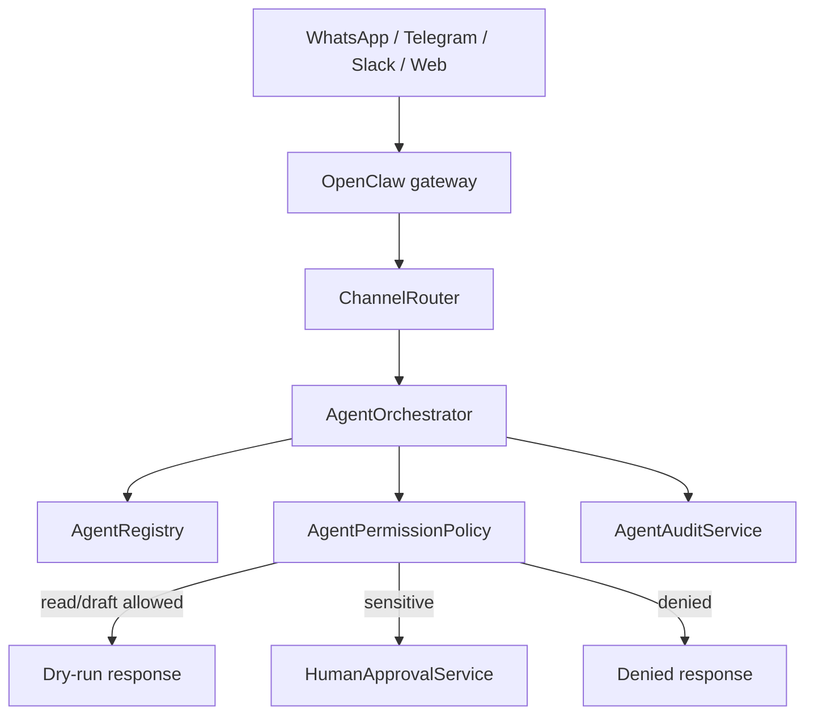

# Agents

CornerOps AI is the business brain, source of truth, orchestration layer,
business memory, permission layer and audit system. OpenClaw is only a
self-hosted multichannel gateway and controlled execution layer.

## Core Agent Pack v0.1

| Agent | Domain | Permission | Channels | Tools |
| --- | --- | --- | --- | --- |
| `cornerops-router-agent` | routing | read_only | whatsapp, telegram, slack, web, internal | none |
| `daily-briefing-agent` | briefing | read_only | whatsapp, telegram, slack, web, internal | `read_tasks`, `read_leads`, `read_quotes`, `read_orders`, `read_calendar` |
| `b2b-sales-agent` | sales | draft_only | whatsapp, telegram, slack, web, internal | `read_leads`, `read_contacts`, `draft_message`, `draft_email`, `create_task_pending_approval` |
| `quotes-orders-agent` | orders | approval_required | slack, web, internal | `read_quotes`, `read_orders`, `draft_message`, `propose_order_status_change`, `propose_payment_mark_paid` |
| `dev-codex-github-agent` | dev | approval_required | slack, telegram, web, internal | `read_github`, `draft_issue`, `draft_pr_description`, `create_issue_pending_approval` |
| `security-audit-agent` | security | read_only | slack, web, internal | `read_audit_logs`, `read_agent_logs`, `read_config_summary` |

## Runtime Flow

## Routing Rules

- Briefing, priorities, blockers and daily summary route to
  `daily-briefing-agent`.
- Leads, restaurants, Latin stores, distributors, Tajin, Pulparindo and sales
  follow-up route to `b2b-sales-agent`.
- Quotes, orders, payment states, Bank Transfer, CoD and manual payment changes
  route to `quotes-orders-agent`.
- GitHub, Codex, issues, PRs, bugs and CI logs route to
  `dev-codex-github-agent`.
- Security, audit logs, rejected actions, permissions and configuration risk
  route to `security-audit-agent`.
- Low-confidence requests safely fall back to `daily-briefing-agent` or ask for
  clarification.

## Approval Flow

Actions that mutate state, send external messages, create real issues, mark
orders as paid, change order status, merge PRs, deploy or touch secrets are
never executed directly. They become pending approval records with proposed
actions and sanitized payloads.

## Audit Flow

Each orchestrator request writes an `agent_audit` event with request ID,
conversation ID, user, channel, selected agent, intent, risk, policy decision,
status, proposed actions and sanitized input/output.

## Existing Workers

The earlier worker layer remains available:

- `supportWorker`
- `salesWorker`
- `ordersWorker`
- `b2bWorker`
- `humanHandoffWorker`

The Core Agent Pack sits above these workers as the operating-system layer for
future multichannel workflows.

## Real Data + Ecosystem v0.1

Los agentes ahora pueden adjuntar `dataSnapshot` usando tools internas:

- `daily-briefing-agent`: leads, follow-ups, quotes, orders, GitHub, audit y data health.
- `b2b-sales-agent`: leads y drafts comerciales.
- `quotes-orders-agent`: quotes, orders, pagos manuales y proposals approval-required.
- `dev-codex-github-agent`: issues, PRs, CI, drafts GitHub y estado OpenClaw ecosystem.
- `security-audit-agent`: audit logs, approvals, skills aprobados y data health.

Las tools pasan por `DataAccessPolicy`, services y repositories. Ninguna tool
approval-required ejecuta cambios reales en v0.1.

## Context & Knowledge Layer v0.2

Los agentes pueden usar context tools para buscar archivos locales mock,
mensajes archivados, notas, PDFs y GitHub archive context. Si una fuente esta
deshabilitada o no hay resultados, el agente debe reportar contexto faltante y
no inventar historial.
