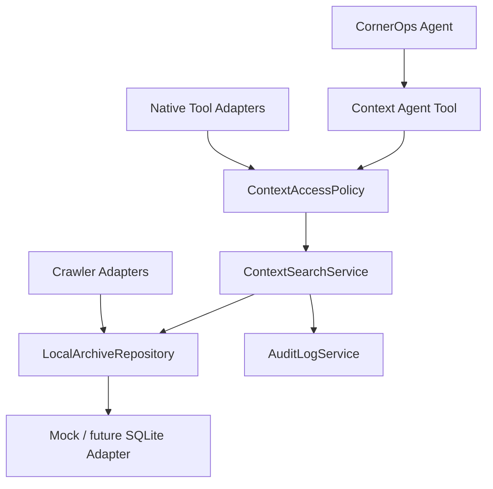

# Context & Knowledge Layer v0.2

CornerOps Context & Knowledge Layer gives agents a local-first memory spine without turning OpenClaw into the brain. CornerOps remains source of truth, policy, audit and decision layer.

## Architecture

## Components

- `ContextSourceRegistry`: source definitions, modes, retention, PII, allowed agents.
- `ContextAccessPolicy`: source/agent/channel/operation enforcement, masking and approval rules.
- `LocalArchiveRepository`: local archive records and search.
- `ContextSearchService`: audited query API.
- `ContextHealthService`: source/archive/crawler/native/SDK health.
- `CrawlerRegistry` and adapters: dry-run/read-only crawlers.
- Native tool layer: disabled by default, root-bounded filesystem safety.

## Security Model

Everything defaults to disabled, mock, read-only and dry-run. Real source enablement, sync, native tools and retention changes require approval. PII is masked by default.

## Agent Flow

Agents receive `dataSnapshot` enrichment from context tools. If no source is enabled or no records match, they must report missing context rather than invent it.
