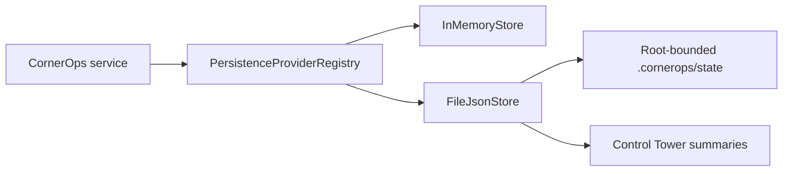

# Persistence v0.8.1

## Boundary

`PersistenceProviderRegistry` creates named stores behind the same synchronous transaction contract:

- `memory`: isolated process memory, automatically used by Jest.
- `file_json`: default local-beta provider under `CORNEROPS_PERSISTENCE_ROOT`.

Approvals, domain audit, agent audit, OpenClaw audit and operator sessions use named stores. Replay protection, rejection tracking and rate limits retain their domain stores but now use the hardened `FileJsonStore` implementation.

## File guarantees

- Paths are constrained by `FsSafeBoundary` to the configured root.
- Directories and files use `0700` and `0600` permissions.
- Values are sanitized before serialization; credential keys and token-shaped secrets are redacted and PII strings are masked.
- Audit and approval services sanitize and truncate private payload summaries before persistence.
- Writes use a same-directory temporary file followed by atomic rename.
- A per-instance transaction guard blocks nested writes.
- Reads and writes enforce `CORNEROPS_FILE_STORE_MAX_BYTES`.
- Corrupted critical stores fail closed with a generic error code and are not copied or printed.
- Corrupted noncritical stores reset to their sanitized initial value.

## Data flow

## Operational limit

`file_json` is a single-process beta store. Atomic rename protects individual file replacement, but there is no cross-process lock, transaction log, relational integrity or multi-host coordination. Use one CornerOps server process only.

The next persistence step should be SQLite for a single-host durable beta or Postgres for multi-user/multi-process operation. That migration should preserve the current store boundary and must not weaken approvals, audit or fail-closed behavior.
