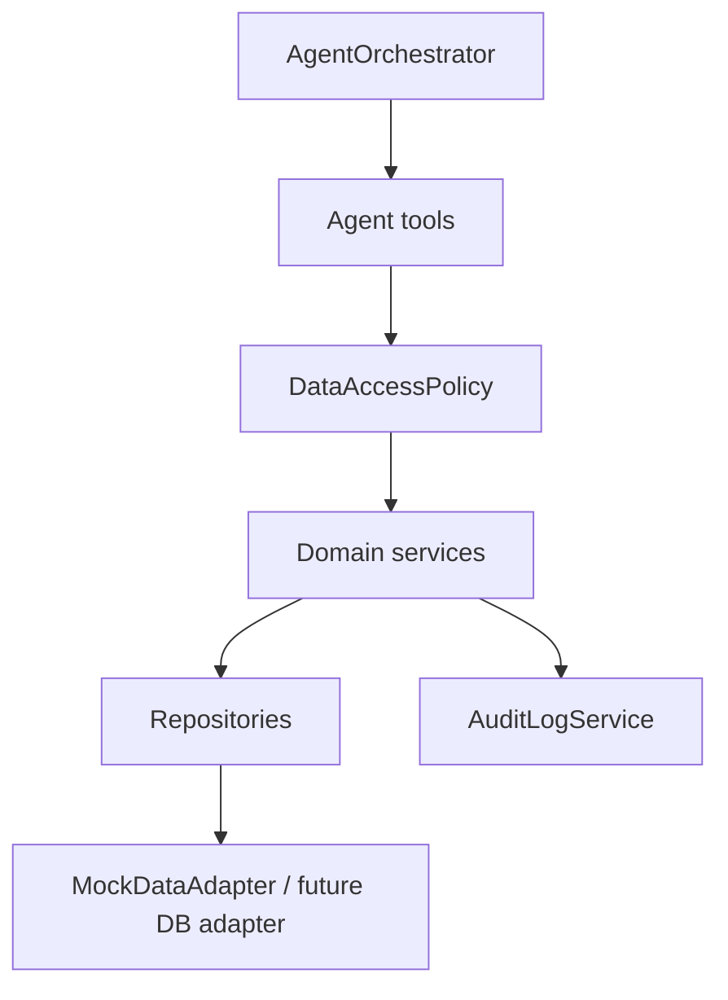
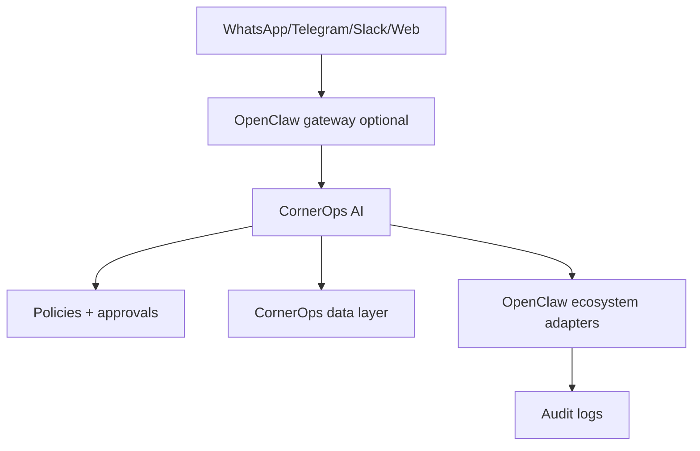

# Real Data Integration v0.1

CornerOps AI sigue siendo el cerebro, fuente de verdad, memoria de negocio, politica y auditoria. OpenClaw y sus servicios son capabilities controladas.

## Estado Actual

- Stack: JavaScript, Express, Jest.
- Modo por defecto: `CORNEROPS_DATA_MODE=mock`, `CORNEROPS_DRY_RUN=true`.
- No hay credenciales reales ni escrituras reales configuradas.
- `MockDataAdapter` carga fixtures realistas sin PII real.
- Supabase/Postgres quedan como adapters seguros/documentados para una migracion posterior.

## Flujo

## Fuentes

Leads, quotes, orders, GitHub, audit logs, approvals, agent logs y sync status se registran en `DataSourceRegistry`. Cualquier write/proposal sensible requiere approval.

## OpenClaw Coexistence

## Supuestos

- Los fixtures son mock, no datos reales.
- DB real y GitHub real requieren flags, credenciales y revision de seguridad.
- Ningun servicio OpenClaw puede operar como source of truth.
