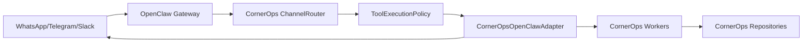
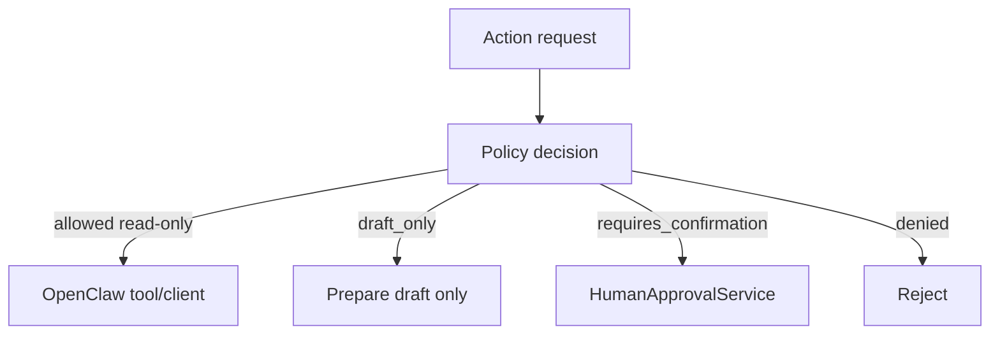
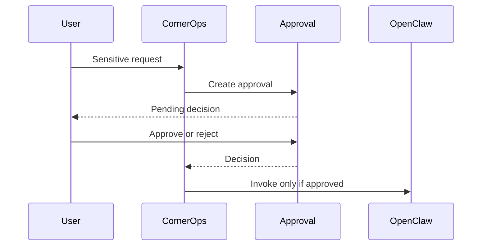
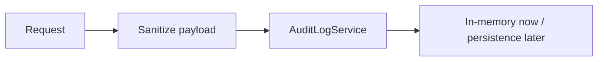
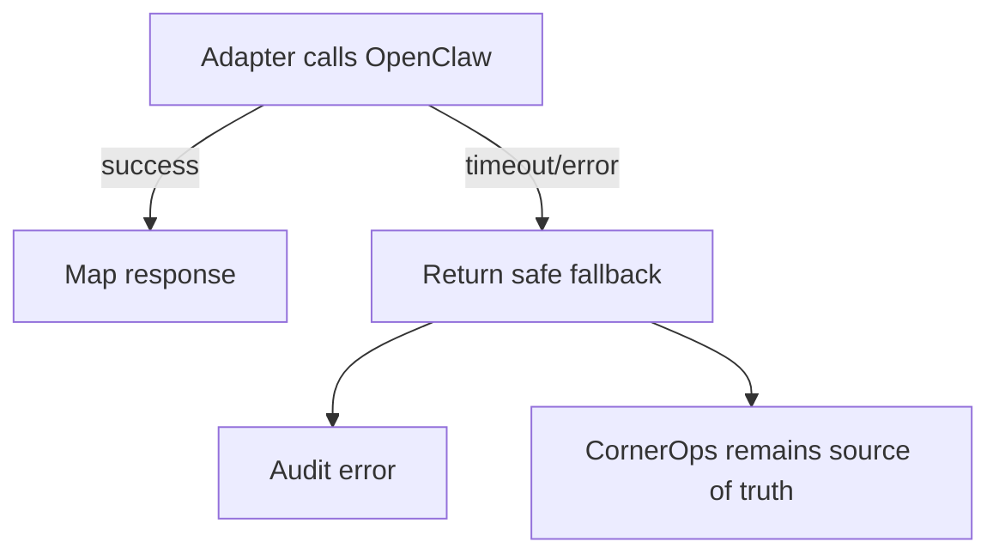

# OpenClaw Integration Architecture

## Message Flow

```mermaid
flowchart LR
  Channel["WhatsApp/Telegram/Slack"] --> OpenClaw["OpenClaw Gateway"]
  OpenClaw --> Router["CornerOps ChannelRouter"]
  Router --> Policy["ToolExecutionPolicy"]
  Policy --> Adapter["CornerOpsOpenClawAdapter"]
  Adapter --> Worker["CornerOps Workers"]
  Worker --> Repositories["CornerOps Repositories"]
  Adapter --> Channel
```

## Tool Execution Flow

```mermaid
flowchart TD
  Request["Action request"] --> Policy["Policy decision"]
  Policy -->|"allowed read-only"| Execute["OpenClaw tool/client"]
  Policy -->|"draft_only"| Draft["Prepare draft only"]
  Policy -->|"requires_confirmation"| Approval["HumanApprovalService"]
  Policy -->|"denied"| Stop["Reject"]
```

## Human Approval Flow

```mermaid
sequenceDiagram
  participant User
  participant CornerOps
  participant Approval
  participant OpenClaw
  User->>CornerOps: Sensitive request
  CornerOps->>Approval: Create approval
  Approval-->>User: Pending decision
  User->>Approval: Approve or reject
  Approval-->>CornerOps: Decision
  CornerOps->>OpenClaw: Invoke only if approved
```

## Audit Flow

```mermaid
flowchart LR
  Request["Request"] --> Sanitize["Sanitize payload"]
  Sanitize --> Audit["AuditLogService"]
  Audit --> Logs["In-memory now / persistence later"]
```

## Fallback Flow

```mermaid
flowchart TD
  Adapter["Adapter calls OpenClaw"] -->|success| Response["Map response"]
  Adapter -->|timeout/error| Fallback["Return safe fallback"]
  Fallback --> Audit["Audit error"]
  Fallback --> CornerOps["CornerOps remains source of truth"]
```
